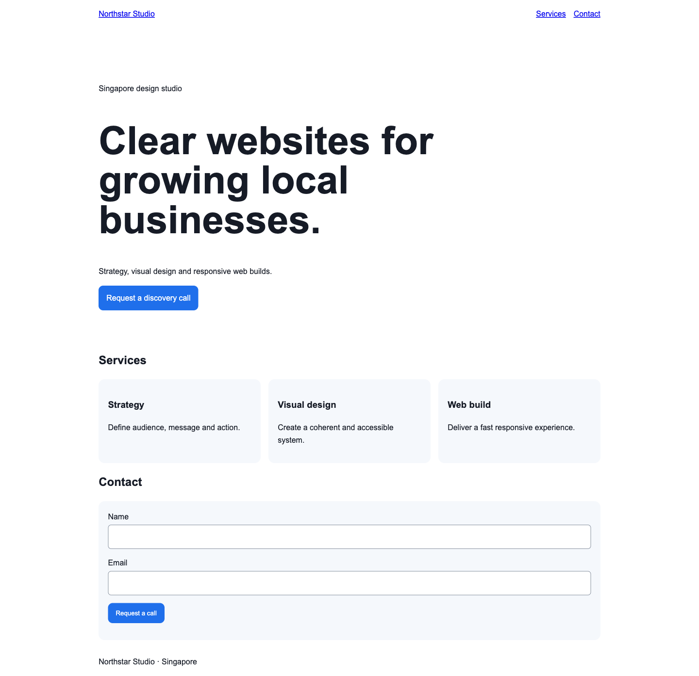

<div align="center">

# AI Agents with Gemini Spark


**Build bounded AI-agent workflows, vibe-code a responsive website, and keep consequential actions under human review.**

[Course page](https://www.tertiarycourses.com.sg/casl-ai-agents-with-gemini-spark.html) · [Report an issue](https://github.com/tertiarycourses/TGS-2026064173-AI-Agents-with-Gemini-Spark/issues)

</div>

## Website lab preview



The screenshot is captured from the supplied, locally tested Lab 2 solution.

## About

This repository contains the public learner materials and hands-on labs for Tertiary Infotech Academy's **AI Agents with Gemini Spark** course. The course combines Gemini Spark task design with a controlled vibe-coding workflow using Claude Code, Codex, or Antigravity.

Learners practise how to:

- translate a web-design outcome into bounded tasks, permissions, risks, stop rules, and approval gates;
- build and test a responsive HTML/CSS/JavaScript website through small, reviewable AI-assisted changes;
- design a reusable Gemini Spark skill and a safe, non-overlapping schedule;
- monitor an agent run, detect prompt injection, contain an incident, recover, and verify one improvement.

## Operating model

```text
Business outcome
      │
      ▼
Bounded task contract ──► Gemini Spark research / coordination
      │                              │
      │                              ▼
      ├──────────────► Coding agent proposes repository changes
      │                              │
      ▼                              ▼
Permission + risk gates ──► Diff review + browser checks
      │                              │
      └──────────────► Human approval / stop / rollback
                                     │
                                     ▼
                           Verified website evidence
```

## Course materials

| Artifact | Purpose |
|---|---|
| `courseware/AI Agents with Gemini Spark-v1.0.pptx` | Concept-led, highly visual trainer deck |
| `courseware/AI Agents with Gemini Spark-v1.0.pdf` | Learner-slide PDF mirror |
| `courseware/LG-AI Agents with Gemini Spark-v1.0.*` | Detailed Learner Guide in DOCX/PDF |
| `courseware/LEARNER-GUIDE.md` | Searchable Markdown mirror of the Learner Guide |
| `courseware/LP-AI Agents with Gemini Spark-v1.0.*` | One-day Lesson Plan in DOCX/PDF |
| `labs/` | Four self-contained practical lab folders |

Assessments and trainer-only answer keys are intentionally not published in this repository.

## Labs

1. **Create the Agent Strategy and Approval Map** — define the task contract, responsibility boundary, least-privilege permissions, risks, stop rules, and evidence.
2. **Vibe Code the Northstar Studio Website** — use Claude Code, Codex, or Antigravity to implement small reviewed changes and test the site at desktop, tablet, and mobile widths.
3. **Design a Reusable Spark Content Skill and Schedule** — specify a trigger contract, output schema, source log, draft-only route, approval gate, and concurrency rule.
4. **Monitor, Contain and Optimise an Agent Run** — detect a tainted source, stop the run, preserve evidence, restore the approved state, and verify a preventive control.

Every lab includes a detailed `README.md`, a PDF guide, working files, mock data, evidence templates, and acceptance criteria.

## Getting started

### Prerequisites

- Git and Python 3
- A modern web browser
- One coding agent: Claude Code, Codex, or Antigravity
- Gemini Spark access where available; Lab 3 includes an offline design path when it is not

### Clone the materials

```bash
git clone https://github.com/tertiarycourses/TGS-2026064173-AI-Agents-with-Gemini-Spark.git
cd TGS-2026064173-AI-Agents-with-Gemini-Spark
```

### Run the website lab

```bash
cd labs/lab-02-vibe-code-the-northstar-studio-website
cp -R starter working-site
python3 -m http.server 8000 --directory working-site
```

Open <http://localhost:8000>, then run the supplied structural check in another terminal:

```bash
python3 scripts/check_site.py working-site
```

## Repository structure

```text
.
├── courseware/
│   ├── assets/
│   ├── AI Agents with Gemini Spark-v1.0.pptx
│   ├── AI Agents with Gemini Spark-v1.0.pdf
│   ├── LEARNER-GUIDE.md
│   ├── LG-AI Agents with Gemini Spark-v1.0.docx
│   ├── LG-AI Agents with Gemini Spark-v1.0.pdf
│   ├── LP-AI Agents with Gemini Spark-v1.0.docx
│   └── LP-AI Agents with Gemini Spark-v1.0.pdf
└── labs/
    ├── lab-01-create-the-agent-strategy-and-approval-map/
    ├── lab-02-vibe-code-the-northstar-studio-website/
    ├── lab-03-design-a-reusable-spark-content-skill-and-schedule/
    └── lab-04-monitor-contain-and-optimise-an-agent-run/
```

## Responsible use

Use mock data in the labs. Never place passwords, payment details, personal data, private API keys, or assessment answer keys in an agent task thread. Keep public communications, publishing, transactions, and sensitive edits behind explicit human approval.

## Developed by

[Tertiary Infotech Academy Pte. Ltd.](https://www.tertiarycourses.com.sg/) · UEN 201200696W

Course research draws on the official [Gemini Spark overview](https://gemini.google/overview/agent/spark/) and [Google Gemini Help](https://support.google.com/gemini/answer/17094507?hl=en&co=GENIE.Platform=Android), with the complete source list embedded in the slide deck and Learner Guide.
